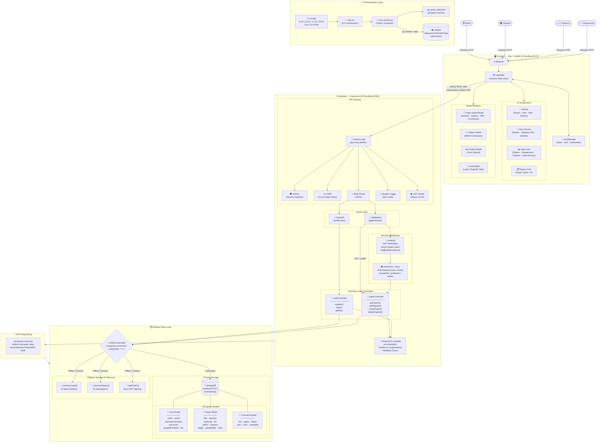
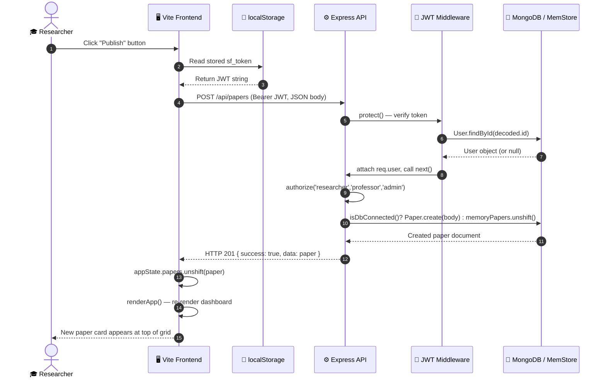
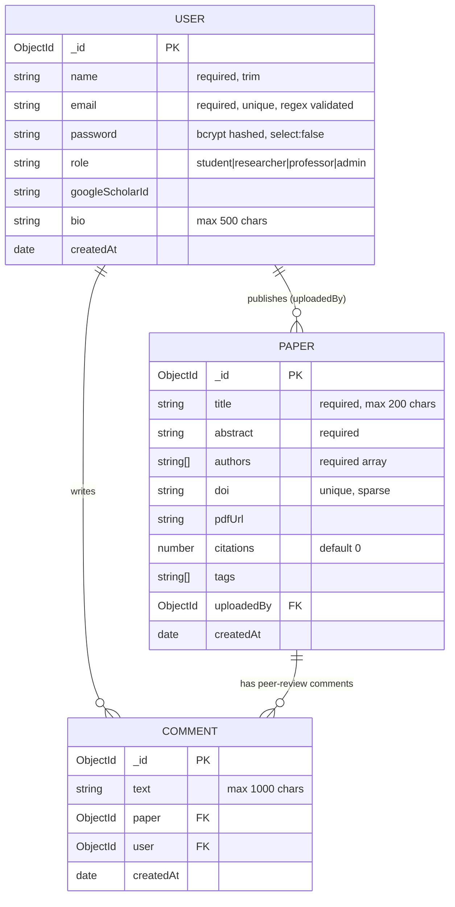
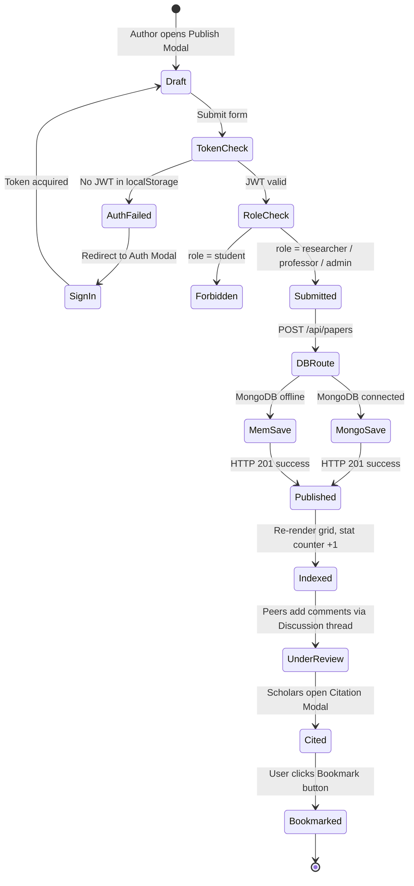

# 🔬 ScholarForge — Academic Research & Open Publication Platform

[](LICENSE)
[](https://nodejs.org)
[](https://vitejs.dev)
[](https://mongodb.com)
[](https://expressjs.com)
[]()
[]()

---

> **ScholarForge** is a full-stack, open-access academic research and publication platform. Researchers, professors, students, and institutions can discover, publish, peer-review, bookmark, and cite high-impact scientific manuscripts. Built with a **resilient dual-storage architecture** that guarantees zero-downtime operation even when the primary database is unreachable.

---

## 📌 Table of Contents

1. [Key Features](#-key-features)
2. [System Design Diagram](#-system-design-diagram)
3. [Architecture Layers Explained](#-architecture-layers-explained)
4. [Data Flow — Request Lifecycle](#-data-flow--request-lifecycle)
5. [Database Schema (ERD)](#-database-schema-erd)
6. [Publication State Machine](#-publication-state-machine)
7. [API Reference](#-api-reference)
8. [Directory Structure](#-directory-structure)
9. [Quick Start Guide](#-quick-start-guide)
10. [Automation & Git Commit Scheduler](#-automation--git-commit-scheduler)
11. [Tech Stack](#-tech-stack)

---

## 🌟 Key Features

| Feature | Description |
|---|---|
| ⚡ **Instant Publishing** | Submit manuscripts with title, abstract, authors, DOI & PDF URL |
| 🛡️ **Zero-Downtime Fallback** | In-memory data engine activates automatically when MongoDB is offline |
| 🔐 **JWT Auth & RBAC** | Role-based access: `student`, `researcher`, `professor`, `admin` |
| 📜 **Citation Generator** | Export BibTeX, APA, IEEE, MLA citation formats in one click |
| 💬 **Peer-Review Threads** | Academic discussion comments attached to every paper |
| 🔖 **Bookmark System** | Save papers to local bookmarks via `localStorage` |
| 🔍 **Smart Search & Filter** | Real-time full-text search + category tag filtering + sort controls |
| 🤖 **Auto-Commit Scheduler** | Python script generating 3–5 dated Git commits per day through October 2026 |

---

## 🏗️ System Design Diagram

This diagram illustrates the **complete ScholarForge system** — from browser request to data storage — including every component, middleware, decision point, and storage engine.



---

## 🏛️ Architecture Layers Explained

### Layer 1 — Frontend (Vite + Vanilla JS)
- **Single `appState` object** is the central reactive state store, holding papers, user session, filters, bookmarks, and search queries.
- **`localStorage`** persists the JWT token, user profile, and bookmarked paper IDs across browser sessions.
- **`renderApp()`** re-renders the entire UI from scratch on every state change, keeping the view always in sync.
- **`fetch()` API calls** communicate with the backend using `Authorization: Bearer <JWT>` headers for protected routes.

### Layer 2 — API Gateway (Express.js)
- **Helmet** sets security HTTP headers (XSS protection, content-type sniffing, referrer policy).
- **CORS** allows cross-origin requests from the Vite dev server (`localhost:5173`).
- **Morgan** logs every request in dev mode for debugging visibility.
- **`/health`** endpoint lets the frontend check if the backend is alive and toggle the status badge.

### Layer 3 — Security Middleware
- **`protect()`** middleware extracts the Bearer JWT from the `Authorization` header, verifies it with `jsonwebtoken`, and attaches the resolved `req.user` object.
- **`authorize(...roles)`** is a higher-order function that checks `req.user.role` against an allowed roles list and throws `403 Forbidden` if unauthorized.

### Layer 4 — Business Logic Controllers
- **`authController`**: Handles `register`, `login`, `getMe`. Checks DB state first; falls back to `memoryUsers[]` if MongoDB is unreachable. Signs JWTs using `bcryptjs` password comparison.
- **`paperController`**: Handles all CRUD operations for research papers. Uses `isDbConnected()` to route queries to MongoDB or `memoryPapers[]` fallback. Supports full-text search, tag filtering, sorting, and field projection.

### Layer 5 — Resilient Data Storage
- **Primary**: MongoDB with Mongoose ODM. `bufferCommands: false` + `serverSelectionTimeoutMS: 2000` prevents hangs.
- **Fallback**: In-memory JavaScript arrays (`memoryUsers[]`, `memoryPapers[]`) with 6 seeded academic papers and 2 scholar profiles. Completely transparent to the API caller.

---

## 🔄 Data Flow — Request Lifecycle



---

## 🗄️ Database Schema (ERD)



---

## 📋 Publication State Machine



---

## 🌐 API Reference

### Auth Endpoints

| Method | Endpoint | Access | Description |
|---|---|---|---|
| `POST` | `/api/auth/register` | Public | Register new academic user |
| `POST` | `/api/auth/login` | Public | Login and receive JWT token |
| `GET` | `/api/auth/me` | Private | Get current authenticated user profile |
| `GET` | `/health` | Public | API health status check |

### Paper Endpoints

| Method | Endpoint | Access | Description |
|---|---|---|---|
| `GET` | `/api/papers` | Public | Fetch all papers (supports `?search=`, `?sort=`, `?select=`) |
| `GET` | `/api/papers/:id` | Public | Fetch single paper by ID |
| `POST` | `/api/papers` | Private (researcher/professor/admin) | Create and publish new paper |
| `DELETE` | `/api/papers/:id` | Private (owner or admin) | Delete paper |

### Sample Request — Create Paper

```json
POST /api/papers
Authorization: Bearer <jwt_token>
Content-Type: application/json

{
  "title": "Quantum Error Correction in Topological Systems",
  "abstract": "We present a fault-tolerant scheme using surface codes...",
  "authors": ["Dr. Elena Rostova", "Prof. Alexander Vance"],
  "doi": "10.1038/s41586-026-04821-x",
  "pdfUrl": "https://arxiv.org/pdf/2401.00001.pdf",
  "tags": ["Quantum Computing", "Physics"]
}
```

---

## 📂 Directory Structure

```
ScholarForge/
├── 📁 backend/
│   ├── 📁 config/
│   │   └── db.js              ← Mongoose connect (bufferCommands:false, 2s timeout)
│   ├── 📁 controllers/
│   │   ├── authController.js  ← register | login | getMe (+ memory fallback)
│   │   └── paperController.js ← getPapers | getPaper | createPaper | deletePaper
│   ├── 📁 middleware/
│   │   ├── auth.js            ← protect() JWT verification | authorize() RBAC
│   │   └── error.js           ← ErrorResponse class | global errorHandler
│   ├── 📁 models/
│   │   ├── User.js            ← Mongoose schema, bcrypt pre-save, getSignedJwtToken()
│   │   ├── Paper.js           ← Title, abstract, authors[], doi, tags[], uploadedBy ref
│   │   └── Comment.js         ← Text, paper ref, user ref, createdAt
│   ├── 📁 routes/
│   │   ├── authRoutes.js      ← POST /register, POST /login, GET /me
│   │   └── paperRoutes.js     ← GET /, POST /, GET /:id, DELETE /:id
│   ├── .env.example           ← PORT, MONGODB_URI, JWT_SECRET template
│   └── server.js              ← Express app init, middleware mount, port listen
│
├── 📁 frontend/
│   ├── index.html             ← HTML entry (Google Fonts: Cormorant Garamond + Plus Jakarta Sans)
│   └── 📁 src/
│       ├── main.js            ← appState, renderApp(), API fetch layer, modals, events
│       └── style.css          ← Warm academic CSS design system (light theme, editorial)
│
├── auto_pusher.py             ← Python script: 3-5 commits/day schedule Jun–Oct 2026
├── test.sh                    ← Bash CLI: --step | --simulate-october | --cron | --status
├── .git_push_state.json       ← State tracker for incremental file push progress
└── README.md                  ← This file
```

---

## 🚀 Quick Start Guide

### Prerequisites
- **Node.js** ≥ 18.0.0
- **npm** ≥ 9.0.0
- **MongoDB** *(Optional)* — app runs fully without it via in-memory fallback

### 1. Clone & Install

```bash
git clone https://github.com/rabeyanoor/ScholarForge.git
cd ScholarForge

# Install backend dependencies
cd backend && npm install && cd ..

# Install frontend dependencies
cd frontend && npm install && cd ..
```

### 2. Configure Environment

Create `/backend/.env`:

```env
PORT=5000
MONGODB_URI=mongodb://localhost:27017/scholarforge
JWT_SECRET=scholarforge_production_secret_key_2026
JWT_EXPIRE=7d
NODE_ENV=development
```

### 3. Run the Platform

```bash
# Terminal 1 — Start Backend (port 5000)
cd backend && npm run dev

# Terminal 2 — Start Frontend (port 5173)
cd frontend && npm run dev
```

Open **`http://localhost:5173`** in your browser.

---

## 🤖 Automation & Git Commit Scheduler

ScholarForge includes a Python-powered automated Git history generator that creates **3–5 realistic commits per day** from June through October 2026.

```bash
./test.sh --status            # Check current push progress (66 steps total)
./test.sh --step              # Run one step manually (copy + commit + push)
./test.sh --simulate-october  # Instantly generate all commits Jun→Oct 2026
./test.sh --cron              # Register 4x daily crontab (9:15 / 13:15 / 17:15 / 20:15)
```

**How it works:**
1. Source files in `.source_backend/` are copied in 10-line increments to `backend/`.
2. Each increment is committed with a descriptive semantic commit message (e.g. `feat: implement password hashing pre-save hook on User schema`).
3. Commit timestamps are backdated using `GIT_AUTHOR_DATE` and `GIT_COMMITTER_DATE` environment variables.
4. Progress is tracked in `.git_push_state.json` so the scheduler is resumable.

---

## 🧰 Tech Stack

| Layer | Technology |
|---|---|
| **Frontend** | Vite v8, Vanilla JavaScript (ES Modules) |
| **Styling** | Custom CSS (warm editorial light theme, Cormorant Garamond + Plus Jakarta Sans) |
| **Backend** | Node.js v18, Express.js v4 |
| **Database** | MongoDB with Mongoose ODM |
| **Auth** | JSON Web Tokens (`jsonwebtoken`), bcrypt (`bcryptjs`) |
| **Security** | Helmet.js, CORS |
| **Logging** | Morgan (dev mode) |
| **Automation** | Python 3, Bash, crontab |
| **Version Control** | Git + GitHub |

---

## 📄 License

Distributed under the **MIT License**. See `LICENSE` for full details.

---

<div align="center">
  <strong>🔬 ScholarForge — Forge the future of academic research</strong><br/>
  <sub>Built with precision for the global research community</sub>
</div>
